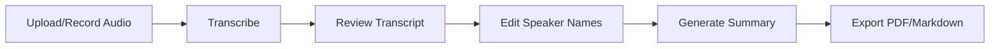

<h1 align="center">MeetMemo</h1>

<p align="center">
  <strong>AI-powered meeting transcription with speaker diarization and intelligent summarization</strong>
</p>

<p align="center">
  <a href="#features">Features</a> •
  <a href="#quick-start">Quick Start</a> •
  <a href="#usage">Usage</a> •
  <a href="#documentation">Documentation</a>
</p>

<p align="center">
  
  
  
  
  
  
  
</p>

---

A meeting transcription application that runs entirely offline. It converts speech to text, identifies different speakers (diarization), and generates intelligent summaries of discussions. Connect it to your local LLM server for customized summarization. Perfect for meetings, interviews, lectures, or any audio where you need a clear transcript and actionable insights.

<div align="center">


</div>

## Features

| Feature | Description |
|---------|-------------|
| **Audio Recording & Upload** | Record meetings directly in browser or upload files (MP3, WAV, M4A, FLAC, WebM, OGG) |
| **Speech Recognition** | faster-whisper with CTranslate2 (4x speedup, 99+ languages) |
| **Speaker Diarization** | PyAnnote.audio 3.1 for automatic speaker identification and labeling |
| **Audio Playback & Sync** | Built-in audio player with transcript synchronization - click any segment to jump to that timestamp |
| **AI Summarization** | LLM-powered summaries with key points, action items, and insights |
| **Real-time Progress** | Live status updates and job management for long-running tasks |
| **Speaker Management** | Edit speaker names with persistent storage across sessions |
| **Export Options** | Professional PDF and Markdown exports for transcripts and summaries |
| **Multi-language** | Automatic language detection or specify target language, with detected-language confidence shown in the UI |
| **Kanban Transcript View** | View the transcript as one column per speaker, ordered by timestamp; drag a line to another speaker to correct misattributed segments |
| **Portuguese Translation** | Translate the transcript to Portuguese on demand (LLM-powered, cached per job) |

## Quick Start

### Prerequisites

| Software | Version | Purpose |
|----------|---------|---------|
| Docker | Latest | Container runtime |
| Docker Compose | Latest | Multi-container orchestration |
| NVIDIA GPU | CUDA 12.1+ | ML model inference (optional, CPU fallback available) |
| LLM Server | Any OpenAI-compatible API | Summarization (e.g., LM Studio, Ollama, OpenAI) |

**Minimum Hardware:**
- GPU: 4GB VRAM (8GB+ recommended)
- RAM: 8GB (16GB+ recommended)
- Storage: 10GB (for models and data)

### Hardware profiles

MeetMemo fits itself to your machine via the `HARDWARE_PROFILE` setting. Leave it
at `auto` (the default) and it detects your GPU VRAM and picks a profile at
startup; the choice is logged and exposed read-only at `GET /api/v1/system` (and
shown in the app footer). Any individual setting (e.g. `WHISPER_MODEL_NAME`)
always overrides the profile.

| Profile | Target VRAM | Whisper | Precision | Diarization |
|---------|-------------|---------|-----------|-------------|
| `cpu` | none (CPU) | base | int8 | speaker-diarization-3.1 |
| `low` | ~4 GB | small | int8_float16 | speaker-diarization-3.1 |
| `balanced` | ~8 GB | turbo | float16 | speaker-diarization-3.1 |
| `high` | 12 GB+ | large-v3 | float16 | speaker-diarization-community-1 |
| `custom` | — | (your env vars only) | | |

> The `high` profile uses **pyannote community-1**, which is more accurate but
> needs ~12 GB VRAM and a one-time license acceptance on Hugging Face. On smaller
> GPUs, stick with `balanced` (or let `auto` decide).

### Installation

**1. Clone and setup:**
```bash
git clone https://github.com/NotYuSheng/MeetMemo.git
cd MeetMemo
cp example.env .env
```

**2. Accept Hugging Face model licenses:**
- Visit [speaker-diarization-3.1](https://huggingface.co/pyannote/speaker-diarization-3.1) → Accept
- Visit [segmentation-3.0](https://huggingface.co/pyannote/segmentation-3.0) → Accept
- Create token at [HF Tokens](https://huggingface.co/settings/tokens) with **Read** access

**3. Configure `.env`:**
```env
# Required
HF_TOKEN=hf_your_token_here
LLM_API_URL=http://localhost:1234
LLM_MODEL_NAME=qwen2.5-14b-instruct
LLM_API_KEY=

# Optional
POSTGRES_PASSWORD=changeme      # Change in production!
TIMEZONE_OFFSET=+8              # Your timezone
```

**4. Start the application:**
```bash
docker compose up -d
```

**5. Access MeetMemo:**

Open **https://localhost** in your browser.

> **Note**: You'll see a certificate warning (self-signed SSL). Click "Advanced" → "Proceed" - this is expected and required for microphone access.

## Usage

### Basic Workflow



1. **Upload or Record** - Upload an audio file or record directly in browser (HTTPS required)
2. **Transcribe** - Click "Start Transcription" to process with Whisper + PyAnnote
3. **Review** - View diarized transcript with speaker labels and timestamps
4. **Playback** - Use the audio player to listen while following along with highlighted transcript segments
5. **Customize** - Click speaker names to rename them (persists across sessions)
6. **Summarize** - Generate AI summary with key insights and action items
7. **Export** - Download professional PDF or Markdown files

### Supported Audio Formats

MP3, WAV, M4A, FLAC, WebM, OGG (max 100MB default)

## Tech Stack

| Component | Technology |
|-----------|------------|
| **Backend** | FastAPI, Python 3.10+, Uvicorn, Pydantic Settings |
| **Architecture** | Layered architecture (API → Service → Repository → Database) |
| **Frontend** | React 19, Vite, Lucide Icons |
| **Reverse Proxy** | Nginx with SSL/TLS (self-signed certs included) |
| **ML Models** | faster-whisper with CTranslate2, PyAnnote.audio 3.1 |
| **Database** | PostgreSQL 16 with asyncpg |
| **Containerization** | Docker, Docker Compose, NVIDIA Container Toolkit |
| **PDF Generation** | ReportLab, svglib |

## Documentation

Comprehensive documentation is available in the [`docs/`](docs/) directory:

| Document | Description |
|----------|-------------|
| **[Architecture](docs/ARCHITECTURE.md)** | System architecture, design patterns, data flow |
| **[API Reference](docs/API.md)** | Complete REST API documentation with examples |
| **[Configuration](docs/CONFIGURATION.md)** | Environment variables, model selection, settings |
| **[Database](docs/DATABASE.md)** | Schema, queries, backup/restore, maintenance |
| **[Deployment](docs/DEPLOYMENT.md)** | Production deployment with HTTPS options |
| **[Development](docs/DEVELOPMENT.md)** | Developer guide for contributing |
| **[Troubleshooting](docs/TROUBLESHOOTING.md)** | Common issues and solutions |

## Common Tasks

### View Logs

```bash
# All services
docker compose logs -f

# Specific service
docker compose logs -f meetmemo-backend
```

### Restart Services

```bash
# Restart all
docker compose restart

# Restart backend only
docker compose restart meetmemo-backend
```

### Backup Data

```bash
# Backup database
docker exec meetmemo-postgres pg_dump -U meetmemo meetmemo > backup.sql

# Backup all volumes
sudo tar -czf meetmemo_backup.tar.gz /var/lib/docker/volumes/meetmemo_*
```

### Access Database

```bash
docker exec -it meetmemo-postgres psql -U meetmemo meetmemo
```

## Deployment

MeetMemo includes **HTTPS with self-signed certificates out of the box**. For production:

- **Internal/Development**: Use built-in self-signed certs (works immediately)
- **Production**: Replace with real certificates or use Cloudflare Tunnel

See [Deployment Guide](docs/DEPLOYMENT.md) for detailed instructions.

## Security

- **Local Processing**: Transcription runs entirely on your server
- **Data Privacy**: Audio never leaves your infrastructure (except LLM summarization)
- **HTTPS**: SSL/TLS enabled by default
- **Database**: PostgreSQL not exposed outside Docker network
- **No Authentication**: Add auth layer for multi-user deployments

## Performance

- **GPU Acceleration**: Automatic CUDA support for faster processing
- **Model Caching**: ML models loaded once at startup
- **Async I/O**: All operations use async/await for concurrency
- **Background Cleanup**: Automatic cleanup of old jobs and exports

## Troubleshooting

Having issues? Check the [Troubleshooting Guide](docs/TROUBLESHOOTING.md) for solutions to:

- Microphone/recording not working
- GPU not detected
- Model download failures
- Container startup issues
- Performance problems

## Contributing

Contributions are welcome! Please see [Development Guide](docs/DEVELOPMENT.md) for:

- Development setup
- Code structure
- Testing guidelines
- Commit conventions

## Sample Outputs

The [`sample-files/`](sample-files/) directory contains example outputs:

- Sample audio files (MP3, WAV)
- Generated transcripts (PDF, Markdown)
- AI summaries with action items
- Application demo GIFs

## Star History

<a href="https://www.star-history.com/?repos=NotYuSheng%2FMeetMemo&type=date&legend=top-left">
 <picture>
   <source media="(prefers-color-scheme: dark)" srcset="https://api.star-history.com/chart?repos=NotYuSheng/MeetMemo&type=date&theme=dark&legend=top-left&sealed_token=HmgVg4N1rckeahOz_2zMziwI-2o4Hr6C0elPi2zON29MjhNmx3vBuKxs60D0eXQLamwiMmJP8U5zSaqfH2IGPMlbPb9tCxV-LgF8deoZkiy8iBM-Q_1GHwScuLs3MynpyKCoPh3FnK0e0n-4N2HEmMfZvucYowt2nYaRN8Hhz96oSRn5akRM-CSWAn0V" />
   <source media="(prefers-color-scheme: light)" srcset="https://api.star-history.com/chart?repos=NotYuSheng/MeetMemo&type=date&legend=top-left&sealed_token=HmgVg4N1rckeahOz_2zMziwI-2o4Hr6C0elPi2zON29MjhNmx3vBuKxs60D0eXQLamwiMmJP8U5zSaqfH2IGPMlbPb9tCxV-LgF8deoZkiy8iBM-Q_1GHwScuLs3MynpyKCoPh3FnK0e0n-4N2HEmMfZvucYowt2nYaRN8Hhz96oSRn5akRM-CSWAn0V" />
   
 </picture>
</a>

## License

This project is licensed under the MIT License. See [LICENSE](LICENSE) for details.
